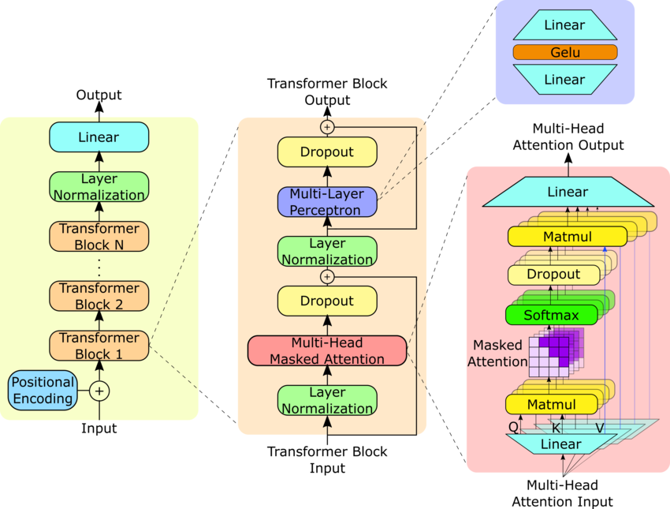

# GPT from Scratch

A basic implementation of GPT-2 while following Sebastian Raschka's *Build a Large Language Model (From Scratch)*.



## Layout

```text
gpt_from_scratch/      # reusable Python modules
notebooks/             # book-following experiments
data/raw/              # source text/data
assets/                # images and README assets
tests/                 # future tests/sanity checks
```

Run notebooks from the repository root so relative paths like `data/raw/the-verdict.txt` resolve correctly.
